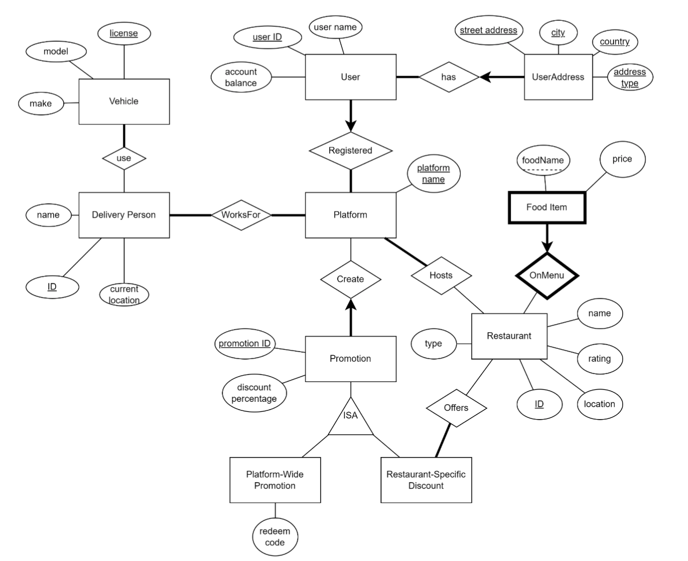

# [Link to the php simple UI](https://www.students.cs.ubc.ca/~yitongta/project_f5k3b_i7n2b_t3q7m/code/front.php?)

# Description of the final project
## The project allows users to retrieve information about food delivery platforms and their relevant data, for example restaurants, users, promotions, etc. Specific tasks that our project accomplishes are:

- Retrieving, inserting, deleting, and updating user addresses.
- Retrieving restaurants by filtering on rates, promotion discount code, platform.
- Restaurants with a rating above a given threshold
- Maximum rating for restaurant types with average rating higher than a given
number
- All restaurants on a given platform
- All restaurants registered on all platforms
- Retrieving delivery persons’ location, id, name, vehicle info.
- Retrieving platform-specific promotion and user balance details.
- Minimum and maximum discounts per platform
- Maximum user balance for each platform with more than one user

 
 

### ER Diagram

 

### Final schema
Our final schema is almost the same as our previously submitted schema, except that it
denormalizes Restaurant to only use one table, to make queries easier to write.
- Platform(platformName:string)
- User_1(username:string, userID:int, account_balance:float, platformName:string)
- UserAddress(streetAddress:string, city:string, country:string, addressType:string, userID:int)
- Restaurant(name:string, restaurantID:int, rating:int, location:string, type:string)
- FoodItem(name:string, restaurantID:int)
- DeliveryPerson(name:string, id:int, currentLocation:string)
- Vehicle2(model:string, make:string)
- Vehicle1(number_plate:string, model:string)
- Promotion(promotionID:int, discountPercentage:float, platform:string)
- PlatformWidePromotion(redeemCode:int, promotionID:int)
- RestaurantSpecificDiscount(restaurantID:int, promotionID:int)
- UsesVehicle (deliveryPersonID:int, number_plate:string)
- WorksFor(deliveryPersonID:int, platform:string)
- Hosts (platform:string, restaurantID:int)
- Offers (restaurantID:int, promotionID:int)

 
 

[Screenshots for data and queries](https://www.students.cs.ubc.ca/~yitongta/descriptions_of_projects_for_resume/simpleDB/data_and_queries.pdf)

 
 

[Screenshots for the GUI in PHP](https://www.students.cs.ubc.ca/~yitongta/descriptions_of_projects_for_resume/simpleDB/GUI.pdf)
